<!-- ══════════════════════ HEADER BANNER ══════════════════════ -->
<div align="center">
  
</div>

<!-- ══════════════════════ TYPING ANIMATION ══════════════════════ -->
<div align="center">
  
</div>

<br/>

<!-- ══════════════════════ CONNECT BADGES ══════════════════════ -->
<div align="center">
  <a href="https://linkedin.com/in/ranaaalihaider"></a>&nbsp;
  <a href="https://twitter.com/"></a>&nbsp;
  <a href="https://instagram.com/"></a>&nbsp;
  <a href="https://discord.com/"></a>&nbsp;
  <a href="mailto:your.email@example.com"></a>
</div>

<br/>

<div align="center">
  
  
</div>

---

<!-- ══════════════════════ ABOUT ME ══════════════════════ -->
## 🧠 About Me

```yaml
name:     "Rana Ali Haider"
title:    "Software Engineer & ERP Developer"
location: "Pakistan"
focus:
  - "Enterprise ERP & Business Systems"
  - "Full-Stack Web (Laravel + MERN)"
  - "Mobile Apps (Flutter)"
  - "IoT Systems (ESP8266, GPS, GSM)"
  - "AI/ML Integration"
currently_building:
  - "Anti-Gravity ERP — Multi-business ERP platform"
  - "GPS Vehicle Tracking System (IoT + Firebase)"
  - "AI-powered Smart Accounting Assistant"
strengths:
  - "System Design & Architecture"
  - "ERP Domain Knowledge (POS, Fleet, Inventory)"
  - "Hardware-to-Cloud IoT Pipelines"
available_for: "Freelance, Collaboration, Open Source"
```

---

<!-- ══════════════════════ TECH STACK ══════════════════════ -->
## 💻 Tech Stack & Tools

#### 🔤 Languages
<p>
  
  
  
  
  
  
  
</p>

#### 🧩 Frameworks & Libraries
<p>
  
  
  
  
  
</p>

#### 🗄️ Databases
<p>
  
  
  
</p>

#### 🔌 IoT & Embedded
<p>
  
  
  
  
  
</p>

#### ☁️ Cloud & Tools
<p>
  
  
  
  
  
  
</p>

---

<!-- ══════════════════════ DOMAINS ══════════════════════ -->
## 🏗️ Domains I Build In

| 🏢 ERP Systems | 📦 Inventory & POS | 🚗 Fleet & GPS Tracking |
|---|---|---|
| Multi-business ERPs, RBAC, reporting | Stock management, barcode, multi-store | GPS tracking, IoT fleet mgmt, vehicle security |

| 📱 Mobile Apps | 🤖 AI & ML | 🌐 Web Platforms |
|---|---|---|
| Flutter + Firebase PWA apps | AI in ERP, demand forecasting, smart assistants | Laravel MVC, MERN stack, REST APIs |

---

<!-- ══════════════════════ GITHUB TROPHIES ══════════════════════ -->
## 🏆 GitHub Trophies

<div align="center">
  
</div>

---

<!-- ══════════════════════ STATS ══════════════════════ -->
## 📊 GitHub Analytics

<div align="center">
  
  
</div>

<div align="center">
  
</div>

---

<!-- ══════════════════════ ACTIVITY GRAPH ══════════════════════ -->
## 📈 Contribution Activity

<div align="center">
  
</div>

---

<!-- ══════════════════════ SNAKE ══════════════════════ -->
## 🐍 Contribution Snake

<div align="center">
  <picture>
    <source media="(prefers-color-scheme: dark)" srcset="https://raw.githubusercontent.com/ranaaalihaider/ranaaalihaider/output/github-contribution-grid-snake-dark.svg" />
    <source media="(prefers-color-scheme: light)" srcset="https://raw.githubusercontent.com/ranaaalihaider/ranaaalihaider/output/github-contribution-grid-snake.svg" />
    
  </picture>
</div>

---

<!-- ══════════════════════ QUOTE ══════════════════════ -->
## ✍️ Dev Quote of the Day

<div align="center">
  
</div>

---

<!-- ══════════════════════ FOOTER ══════════════════════ -->
<div align="center">
  
</div>
